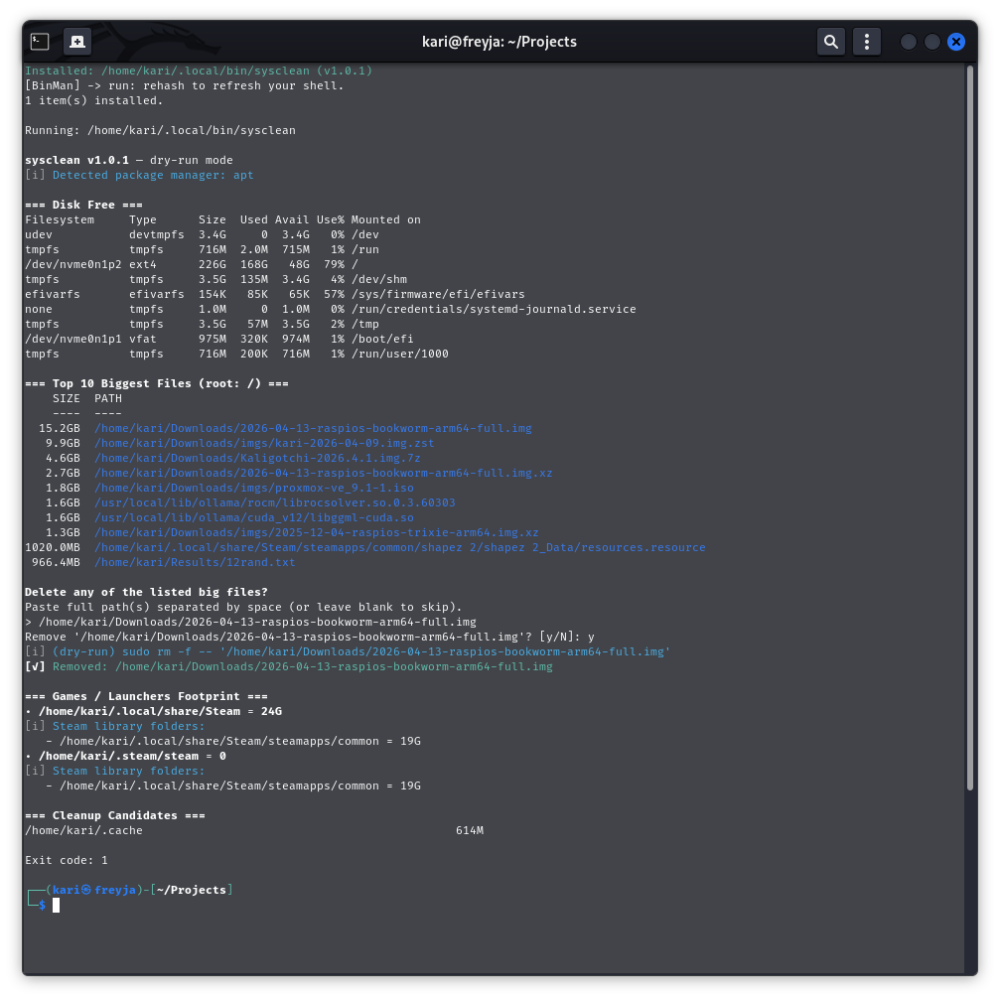
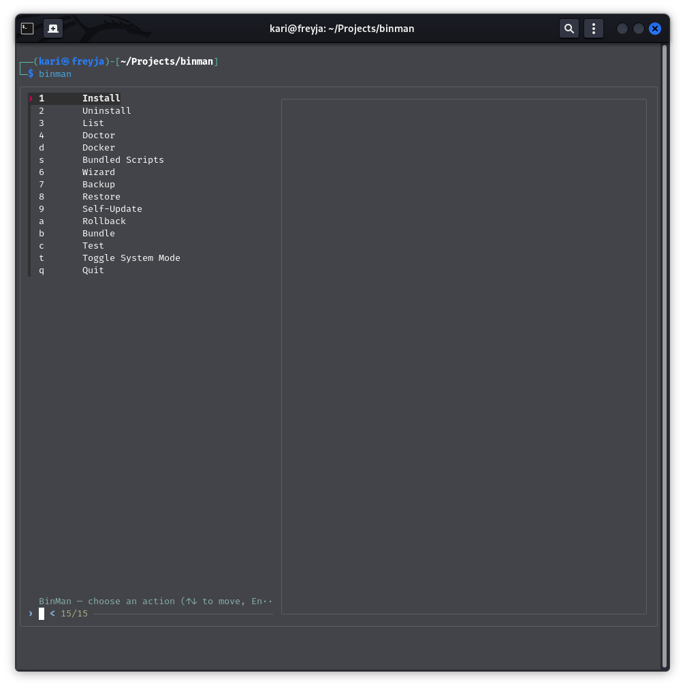
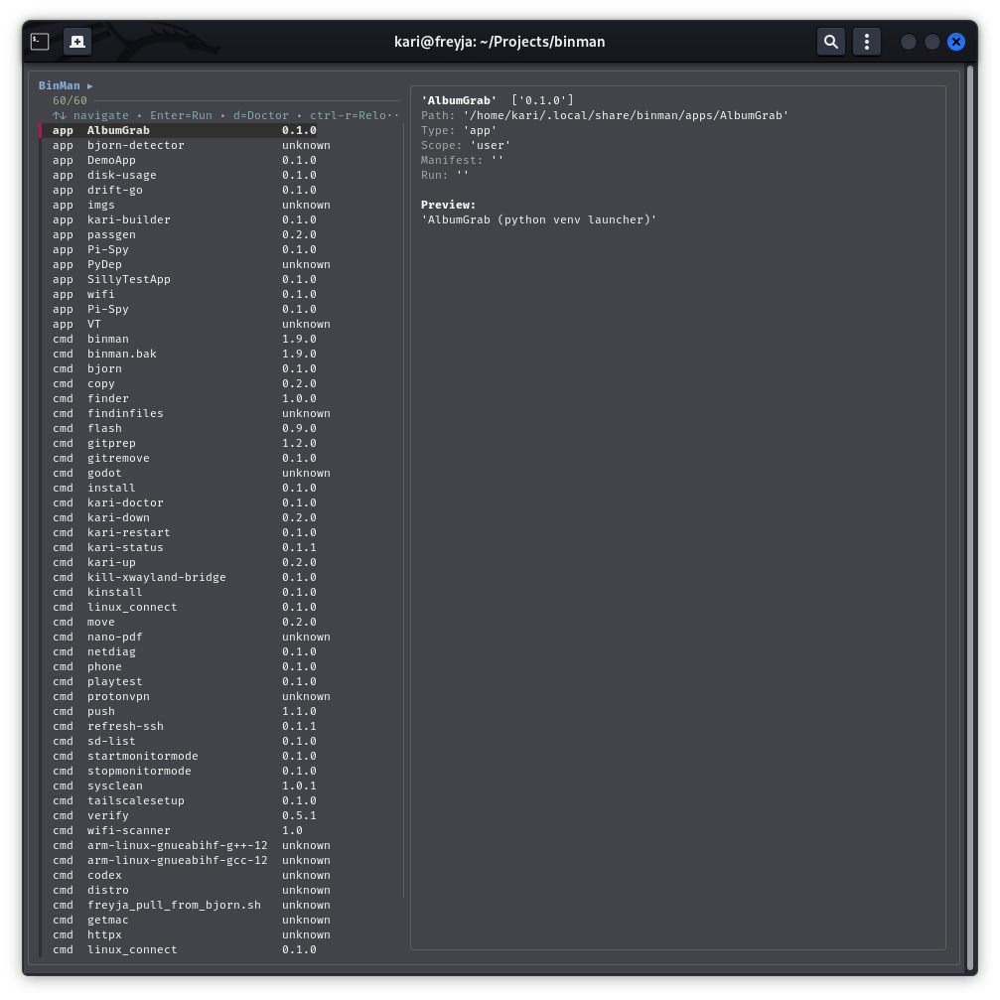
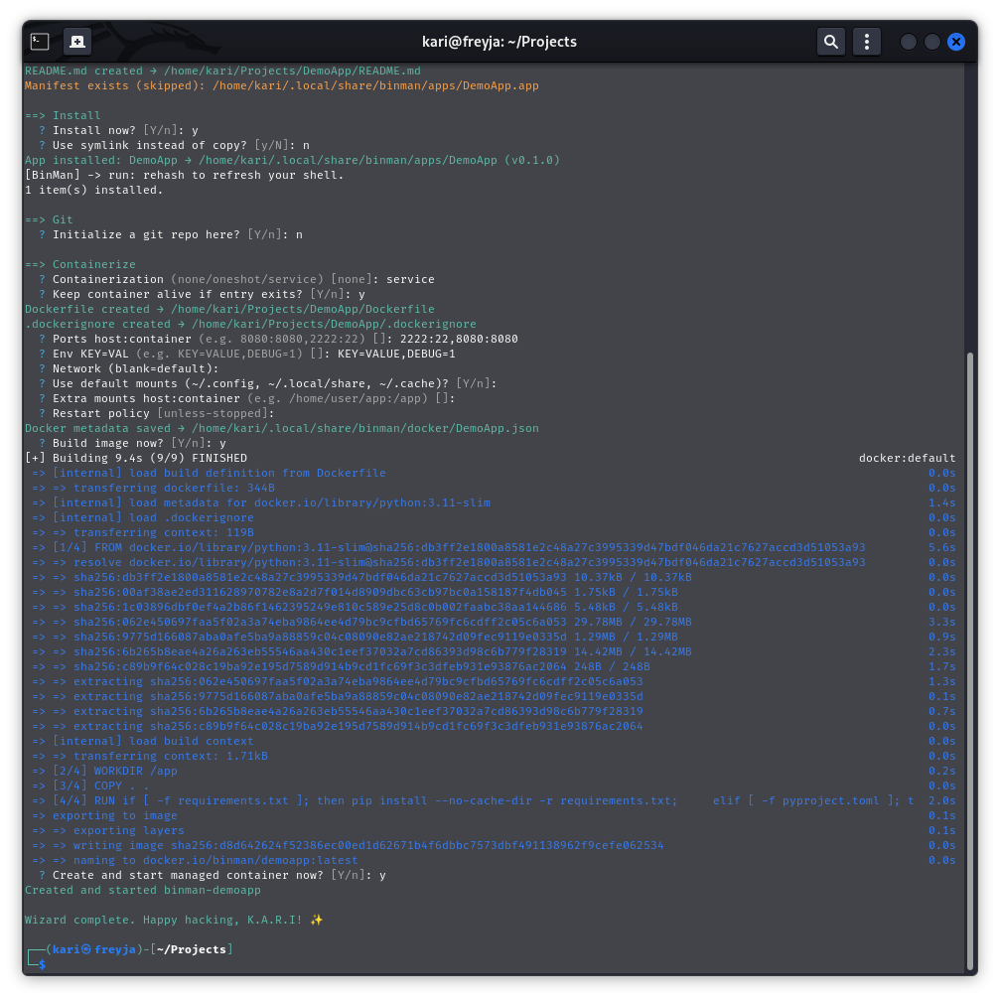
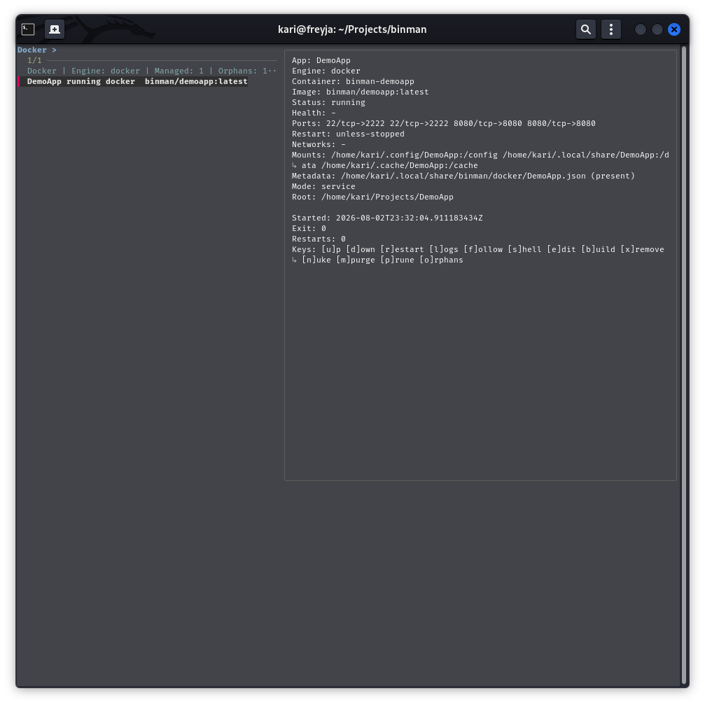
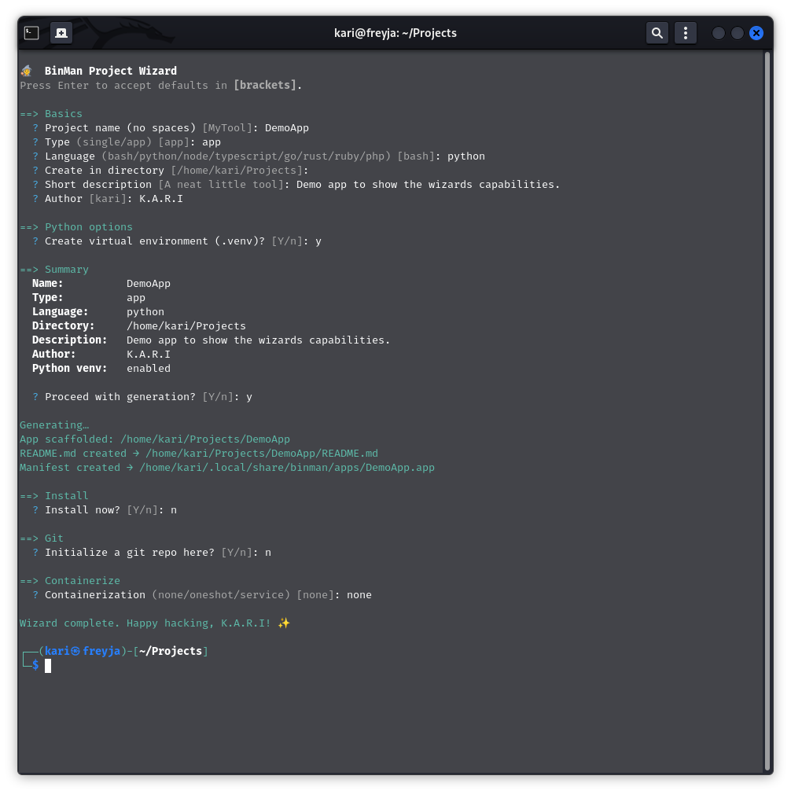
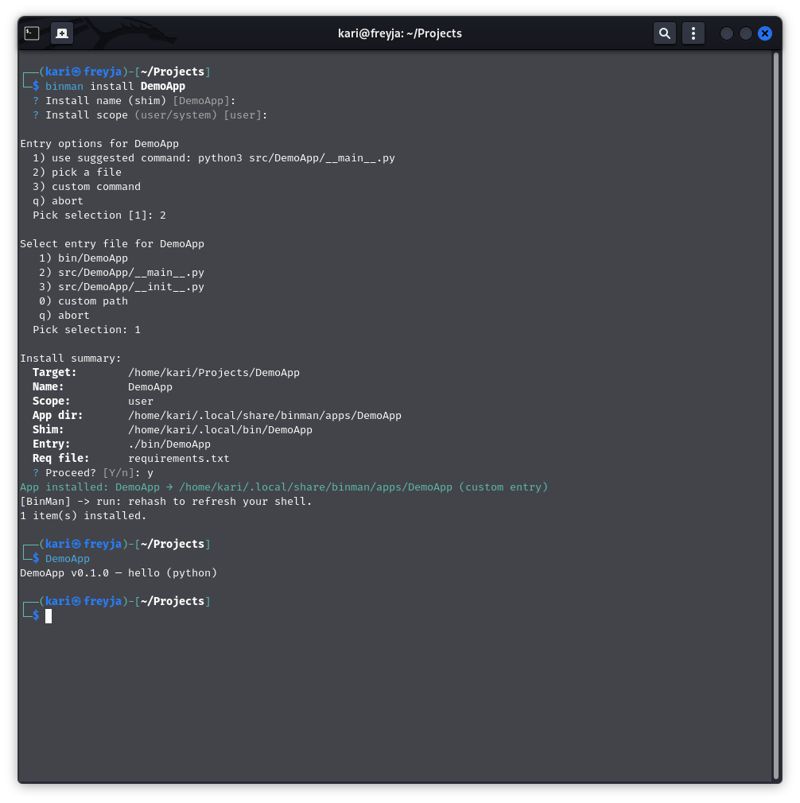
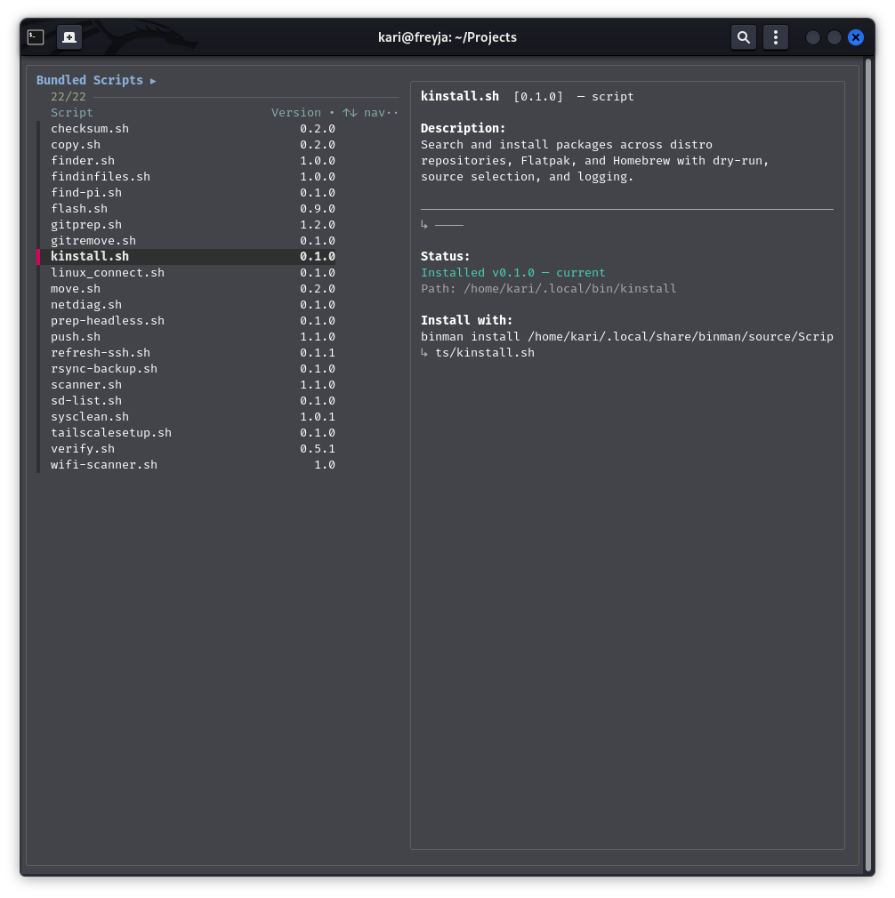

# BinMan

**A personal command manager for scripts and small applications.**

Because `~/Downloads` is not a filing system, champ.

BinMan turns loose scripts and small multi-file projects into commands you can
run from anywhere. It is written in Bash, prefers boring portable tools, and
has enough K.A.R.I. attitude to stop your toolbox becoming a landfill.

BinMan is not just the thing that installs your tools. It ships useful ones
too. Here is `sysclean` being installed and run against a real machine:



*SysClean reports disk usage, surfaces oversized files, and presents cleanup
candidates. The screenshot is deliberately candid: the current script exits
with status 1 after its cleanup path, so this is a real workflow capture—not a
carefully airbrushed K.A.R.I. success story.*



*BinMan's home screen: one toolbox, fifteen ways to get into trouble, and a
quit option for when K.A.R.I. has had enough.*

No cloud dashboard. No subscription. Just your little tool, promoted from
"file I hope I can find later" to "command I can run anywhere".

This README has two layers throughout:

- **Noob mode** explains the idea and gives the shortest useful command.
- **Pro mode** explains what BinMan actually does, where files go, what can
  fail, and which assumptions the implementation makes.

If you only want to install something, start with Noob mode. If you are
debugging, automating, packaging, or deciding whether to trust an operation,
open Pro mode too. The technical sections still contain the jokes; K.A.R.I.
has never believed that a warning needs to sound like a tax form.

Version documented here: **v1.9.0**

## Table of Contents

- [What BinMan Is](#what-binman-is)
- [Highlights](#highlights)
- [Quick Start](#quick-start)
- [Common Examples](#common-examples)
- [Compatibility](#compatibility)
- [How BinMan Stores Things](#how-binman-stores-things)
- [Command Reference](#command-reference)
  - [Wizard](#wizard)
  - [TUI](#tui)
- [App Detection and Python Environments](#app-detection-and-python-environments)
- [Bulk Installs and Manifests](#bulk-installs-and-manifests)
- [Safety, Backups, and Rollbacks](#safety-backups-and-rollbacks)
- [Bundled Scripts](#bundled-scripts)
- [Examples](#examples)
- [Testing and Troubleshooting](#testing-and-troubleshooting)
- [Known Limitations](#known-limitations)
- [Manual Page](#manual-page)
- [Documentation Map](#documentation-map)
- [Dependencies and Portability](#dependencies-and-portability)
- [License](#license)

---

## What BinMan Is

### Noob mode

BinMan installs scripts, app directories, and remote scripts as ordinary
commands. Give it a file or project, and it puts a runnable command in your
user bin directory.

```bash
binman install ./my-tool.sh
my-tool
```

It can also browse installed tools, install the bundled utilities in
`Scripts/`, make backups, restore them, and open a friendly terminal interface.

<details>
<summary><strong>Pro mode</strong> — technical details</summary>

BinMan is one Bash executable, `binman.sh`, with these core behaviors:

- A single file is copied to `~/.local/bin/<basename-without-last-extension>`.
- A directory is copied to
  `~/.local/share/binman/apps/<name>` and exposed through a shim in
  `~/.local/bin/<name>`.
- A URL is downloaded to a temporary directory and then treated as a single
  file. Downloads use `curl` or `wget`.
- `--system` changes the destinations to `/usr/local/bin` and
  `/usr/local/share/binman/apps`; system installs may re-exec through `sudo`.
- Versions are read from a directory `VERSION` file, or from simple markers
  such as `VERSION=`, `# Version:`, and `__version__ =`.
- The inventory cache lives under `${XDG_STATE_HOME:-~/.local/state}/binman`.

BinMan is a manager for personal tools, not a replacement for a distro package
manager. It does not build every project automatically, and it cannot change
the parent shell's command hash table from inside a child process. After an
install it refreshes its own shell process and prints the appropriate parent
shell command (`rehash` or `hash -r`).

</details>

---

## Highlights

### Noob mode

BinMan is more than a fancy `cp` command with a hat:

- Install individual scripts, project directories, remote files, or manifests.
- Turn installed tools into commands in `~/.local/bin`.
- Detect common app layouts and Python projects.
- Browse tools with a Wizard, terminal UI, `fzf`, and bundled-script browser.
- Verify, back up, restore, and roll back your personal command collection.
- Manage Docker or Podman containers for installed applications.
- Scaffold new projects in Bash, Python, Node, TypeScript, Go, Rust, Ruby, or PHP.

<details>
<summary><strong>Pro mode</strong> — technical details</summary>


The feature set is deliberately layered. The normal install path stays small:
stage a target, validate what can be validated, install it, and refresh the
inventory. The surrounding features build a personal tool lifecycle around
that command: discovery, app entry detection, venv setup, metadata, backups,
container metadata, diagnostics, and recovery. None of that requires a server
or a BinMan account. Your toolbox remains gloriously local.

</details>

---

## Quick Start

### Noob mode

Install BinMan itself:

```bash
git clone https://github.com/karialo/binman.git
cd binman
bash binman.sh install binman.sh
```

Refresh the command lookup in your current shell when BinMan asks:

```bash
rehash 2>/dev/null || hash -r 2>/dev/null || true
binman
```

If the command is still not found, add the user bin directory to your PATH:

```bash
export PATH="$HOME/.local/bin:$PATH"
```

For persistence, put that export in the startup file used by your shell, or
run `binman doctor --fix-path`.

<details>
<summary><strong>Pro mode</strong> — technical details</summary>

The installer is interactive when both stdin and stdout are TTYs. In a
non-interactive command, a single file can be installed directly, but a project
directory requires an explicit entry command:

```bash
binman install ./tool.sh
binman install ./MyApp --entry 'python3 src/main.py' --workdir src
```

The command itself must already be executable or have a usable interpreter
shebang when BinMan is choosing a conventional entry. The installed command
name is derived from the final path component with its last extension removed;
interactive installs can override that name.

The refresh message is not a failure. A program launched as `binman` is a child
of Bash, Zsh, Fish, or another shell and cannot mutate the parent's in-memory
hash table. A shell function wrapper can make that refresh automatic, but
BinMan does not edit shell startup files merely to install a command.

</details>

---

## Common Examples

### Noob mode

Start with tasks, not the entire command dictionary. K.A.R.I. approves.

```bash
# Install a shell script; the .sh suffix becomes optional
binman install ./cleanup.sh
cleanup

# Install a project directory
binman install ./MyApp
MyApp

# Choose a shorter command name
binman install ./ridiculously-long-script-name.sh --name tidy
tidy

# Browse the bundled utilities
binman scripts

# Open the terminal interface
binman

# Check the installed command collection
binman verify
```

<details>
<summary><strong>Pro mode</strong> — technical details</summary>


For automation, prefer explicit targets and flags. Directory installs that run
without a TTY need an explicit entry command; interactive installs can let the
Wizard or entry picker help you choose one:

```bash
binman install ./weather-app --entry 'python3 src/main.py' --venv
binman install --manifest tools.txt
binman install --system ./MyApp --entry './bin/MyApp'
binman doctor --all --python 3.11
BINMAN_AUTO_BACKUP=1 binman update ./cleanup.sh
```

</details>

---

## Compatibility

### Noob mode

BinMan itself runs under Bash. Linux is the primary target. Zsh and Fish users
can call it normally; BinMan runs as Bash and prints the right shell-refresh
hint after installs.

<details>
<summary><strong>Pro mode</strong> — technical details</summary>


| Platform or shell | Status | Notes |
|---|---|---|
| Linux | Primary target | System mode, `sudo`, `systemd`, `lsblk`, networking, and Pi tools are developed here. |
| WSL | Expected to work | Linux paths and available host integrations determine the result. |
| macOS | Experimental | BSD utility differences may affect diagnostics and bundled Linux tools. |
| Bash | Required | `binman.sh` is a Bash program using Bash arrays, maps, and process substitution. |
| Zsh | Supported as caller | BinMan runs through Bash and reports `rehash` for the parent shell. |
| Fish | Supported as caller | PATH patching is supported; Fish does not need a hash-table reset. |
| BusyBox / BSD Unix | Not certified | Some required GNU/Linux utilities and flags may be absent. |

There is no universal compatibility badge hiding in the shrubbery. Features
such as Pi flashing, systemd persistence, Docker/Podman, and distro package
installation are necessarily platform-dependent. Test the specific workflow
on the target system before treating it as portable.

</details>

---

## How BinMan Stores Things

### Noob mode

User installs go here:

```text
~/.local/bin/                         commands and app shims
~/.local/share/binman/apps/           copied app directories
~/.local/share/binman/source/         cached repository used by `binman scripts`
~/.local/state/binman/                inventory and state
~/.local/share/binman/rollback/       optional rollback snapshots
```

You normally only need to put `~/.local/bin` in PATH.

<details>
<summary><strong>Pro mode</strong> — technical details</summary>

Single-file installs are atomic-ish: BinMan stages a temporary file, checks
Bash syntax when the file looks like a shell script, makes it executable, and
moves it into the target bin directory. Existing files are not replaced unless
`--force` is supplied.

App installs have two layers:

1. The project payload is stored under the app store.
2. A small Bash shim changes into the configured working directory and executes
   the configured entry command with the user's arguments.

For a conventional app containing `bin/<name>`, the shim executes that file.
For a detected or manually supplied command, the shim reconstructs the command
and then uses `exec`, so signals and the exit status belong to the real tool.

`--link` changes directory-app storage from a copied tree to a symlink. It is
intended for development workflows. Ordinary single-file installs are still
copied; `--link` does not turn those into symlinks.

System mode uses `/usr/local/bin` and `/usr/local/share/binman/apps`. When safe,
BinMan also maintains a root-visible symlink in `/usr/bin` or `/bin`; it only
removes a symlink if it can prove that the link points at BinMan's own system
shim.

</details>

---

## Command Reference

The complete top-level command set is:

```text
install scripts uninstall verify list update doctor docker new wizard tui
backup restore self-update rollback prune-rollbacks analyze bundle test sudo
version help
```

Global flags can appear before the command, and `--system` is also accepted
after an install target.

### Core Commands

`install` · `uninstall` · `list` · `verify` · `update`

The everyday toolbox: put things somewhere useful, inspect them, change them,
and remove them when they have outlived their dramatic little purpose.

### Interactive Commands

`wizard` · `scripts` · `binman` with no arguments

The friendly surfaces: guided project creation, bundled-script browsing, and
the terminal menu.

### Recovery and Maintenance

`doctor` · `backup` · `restore` · `rollback` · `prune-rollbacks` ·
`self-update`

The "something happened and now we are being adults" department.

### Advanced Tools

`docker` · `bundle` · `analyze` · `test` · `sudo` · `new`

Container management, portability bundles, disk investigation, test harnesses,
privileged execution, and scaffolding.

---

### Install

#### Noob mode

```bash
binman install ./hello.sh
binman install ./MyApp
binman install https://example.org/tool.sh
binman install --from ./Scripts
binman install --system ./MyApp
```

Install one file, one directory, one URL, or all executable files in a
directory. Use the interactive wizard if you need to choose an app entry.

<details>
<summary><strong>Pro mode</strong> — technical details</summary>


```text
binman install TARGET [--entry COMMAND] [--workdir DIR]
                    [--venv] [--req FILE] [--python INTERPRETER]
                    [--name NAME] [--link] [--force] [--system]
binman install --from DIR [--link] [--force]
binman install --manifest FILE [--force]
```

`--from` scans for executable files only. It does not recursively install
every file in a tree. A text manifest ignores blank lines and `#` comments;
JSON manifests are accepted when `jq` is available and are expected to contain
an array of strings or objects with a `source` field.

Remote targets are fetched into a temporary directory. BinMan does not provide
cryptographic verification for a URL before installing it; verify remote
content yourself when that matters.

Single-file Python targets receive special handling: BinMan creates a stable
payload under `~/.config/<name>/app.py`, creates a venv under that directory,
and installs a neighboring `requirements.txt` when present. Directory apps
use the app-store venv flow described in [Python environments](#app-detection-and-python-environments).

</details>

---

### Uninstall

#### Noob mode

```bash
binman uninstall hello
binman uninstall MyApp
binman uninstall --dry-run hello MyApp
```

Remove a command or app. Use `--dry-run` when you want to see the plan first.

<details>
<summary><strong>Pro mode</strong> — technical details</summary>


BinMan checks the active user or system target, removes the app payload and its
shim when the name identifies an app, and removes a command file otherwise.
For compatibility, `hello.sh` can resolve to an installed `hello`; a literal
`.bak` name is never silently stripped. Destructive uninstalls create a
snapshot only when `BINMAN_AUTO_BACKUP=1` is enabled.

</details>

---

### Verify

#### Noob mode

```bash
binman verify
```

Check all installed items.

<details>
<summary><strong>Pro mode</strong> — technical details</summary>


For commands, verification checks that the installed path exists and is
executable. For apps, it checks the stored app directory, the expected
`bin/<name>` entry, and the shim. It does not execute the program, test its
dependencies, or compare it with the original source checksum. The current
top-level dispatcher runs the all-items path; although the internal verifier
has name-filtering logic, positional names are not currently forwarded by the
public `verify` command. Failures use a non-zero status.

</details>

---

### List

#### Noob mode

```bash
binman list
```

See installed commands and versions. With `fzf`, the list becomes a searchable
browser with previews.



<details>
<summary><strong>Pro mode</strong> — technical details</summary>


The inventory scans user and system command/app stores, prefers an app record
over a same-named shim, extracts metadata, and writes a cache under the BinMan
state directory. The plain list hides app directories unless
`BINMAN_INCLUDE_APPS=1`; the fuzzy browser can show richer previews. Versions
may be `unknown` when no supported marker is present.

</details>

---

### Scripts

#### Noob mode

```bash
binman scripts
```

Browse the bundled utilities. `fzf` gives you search and a preview pane;
without it, BinMan uses a numbered menu.

<details>
<summary><strong>Pro mode</strong> — technical details</summary>


The command reads from the cached repository at
`~/.local/share/binman/source/Scripts`. A fresh install may not have that cache;
run `binman self-update` from an installed copy or run BinMan from a repository
checkout. The selected row carries name, version, absolute path, and
description metadata; BinMan installs the actual third field, the script path.

</details>

---

### Update

#### Noob mode

```bash
binman update ./hello.sh
binman update ./MyApp
```

Reinstall a tool from its source and overwrite the installed copy.

<details>
<summary><strong>Pro mode</strong> — technical details</summary>


`update` sets `FORCE=1` and routes through the normal installer, so app entry
detection and Python handling are reused. `--from` can update all executable
files in a directory. A rollback snapshot is taken only when automatic
backups are enabled. The help banner still mentions a `--git` option, but the
current parser does not wire that option into the public update command.

</details>

---

### Doctor

#### Noob mode

```bash
binman doctor
binman doctor --fix-path
binman doctor MyApp
binman doctor --all --python 3.11
```

Doctor reports paths and optional tools, fixes PATH configuration, and can
prepare Python apps.

<details>
<summary><strong>Pro mode</strong> — technical details</summary>


With no target, Doctor prints the active mode, bin directory, app store, archive
tool availability, PATH status, and possible `binman` shadowing, then lets an
interactive user choose an app. `--all` processes every installed app;
`--dry-run` reports planned Python work. Python apps get a `.venv`, pip is
updated best-effort, and dependencies come from `requirements.txt` or a basic
`pyproject.toml` dependency list. An executable `.binman/doctor.sh` hook is run
from the app directory.

`--fix-path` appends the user-bin export to existing `.zshrc`, `.zprofile`,
`.bashrc`, and `.profile` files, and adds a Fish config entry when Fish is
installed. It does not reload the current shell.

</details>

---

### Docker

#### Noob mode

```bash
binman docker
binman docker up MyApp
binman docker logs MyApp
binman docker shell MyApp
binman docker down MyApp
```

BinMan can manage containers for installed apps when Docker or Podman is
available.



*The Wizard scaffolds the app, builds the image, and creates the managed
service. The robot has been fed and is now listening on the configured ports.*



*The Docker screen exposes the useful bits at a glance: running status, image,
ports, mounts, restart policy, metadata, and the available management keys.*

<details>
<summary><strong>Pro mode</strong> — technical details</summary>


```text
binman docker up|down|restart|logs|follow|shell|edit|build|remove|nuke|purge APP
binman docker run APP -- COMMAND [ARGS...]
binman docker prune
binman docker orphans
```

Metadata is stored under `~/.local/share/binman/docker` unless
`BINMAN_DOCKER_DIR` overrides it. `--engine docker|podman` chooses the backend;
otherwise BinMan detects a usable engine. `up` creates or starts a managed
service, `build` builds from the app metadata root, `edit` changes ports,
mounts, environment, restart policy, and network, `run` performs a one-shot
execution, and `nuke` removes the managed container and image. `purge` removes
BinMan metadata for an app. These commands affect real containers and images;
read the preview before using `remove`, `nuke`, or `prune`.

</details>

---

### Backup and Restore

#### Noob mode

```bash
binman backup
binman backup my-tools.zip
binman restore my-tools.zip
```

Back up BinMan-curated apps, then merge them back later. Run `binman backup`
inside a terminal for the guided flow: choose all or selected apps, keep or
exclude virtual environments, review the size and destination, then approve
the archive.

<details>
<summary><strong>Pro mode</strong> — technical details</summary>


In a TTY, `binman restore` opens BinMan's archive picker; in a non-TTY it
accepts the archive path directly. The help banner currently advertises a
`--restore FILE` convenience form, but the current top-level option parser does
not dispatch that form, so use the `restore` command and provide the path in a
non-TTY/scripted context.

Backups prefer ZIP when both `zip` and `unzip` exist; otherwise they use
`.tar.gz`. The archive contains selected curated app directories, their
matching BinMan shims under `bin/`, and `meta/info.txt` with the BinMan
version, paths, timestamp, scope, and host information. Unrelated executables
in `~/.local/bin` are deliberately excluded. Virtual environments are kept by
default; `--exclude-venvs` also omits generated caches and build directories.

Restore accepts `.zip`, `.tar.gz`, and `.tgz`, detects a top-level wrapper
directory, merges `bin/` and `apps/`, and restores executable bits. Restore is
not a package lockfile and does not restore external dependencies or a shell's
PATH.

</details>

---

### Rollback and Prune-Rollbacks

#### Noob mode

```bash
BINMAN_AUTO_BACKUP=1 binman install ./tool.sh
binman rollback
binman prune-rollbacks
```

Rollback returns the latest saved BinMan state. Prune removes old snapshots.

<details>
<summary><strong>Pro mode</strong> — technical details</summary>


Automatic snapshots are **disabled by default**. Set `BINMAN_AUTO_BACKUP=1`
before install, update, uninstall, restore, or other mutating flows to save
`bin/`, `apps/`, and metadata under:

```text
~/.local/share/binman/rollback/<timestamp>/
```

`BINMAN_ROLLBACK_KEEP` defaults to 20 snapshots when pruning. `rollback` in the
current command dispatcher applies the latest snapshot; the interactive TUI
can select a specific timestamp. Restore/rollback merges files and does not
delete unrelated newer files.

</details>

---

### Bundle

#### Noob mode

```bash
binman bundle my-environment.zip
```

Export your curated apps and their matching command shims into a portable
archive.

<details>
<summary><strong>Pro mode</strong> — technical details</summary>


The bundle contains curated `bin/` shims, curated `apps/`, and
`manifest.txt`. ZIP is used when available; otherwise the output becomes a
`.tar.gz`. This is a payload bundle, not a full machine image: it does not
include package-manager state, language runtimes, Docker images, or shell
configuration.

</details>

---

### Analyze

#### Noob mode

```bash
binman analyze
binman analyze --top 10 --root /var
```

See large directories and files so you know what is eating the disk.

<details>
<summary><strong>Pro mode</strong> — technical details</summary>


Analyze prints `df -hT`, the largest `du -xhd1` directories, and the largest
files found with `find -xdev`. It skips `/proc`, `/sys`, `/dev`, and `/run` in
the file scan and may use the configured sudo helper for unreadable locations.
It does not delete anything; use `sysclean` for interactive cleanup.

</details>

---

### New

#### Noob mode

Create a starter file or app without answering a parade of questions:

```bash
binman new tidy.sh
binman new MyTool --app --lang python --venv
```

<details>
<summary><strong>Pro mode</strong> — technical details</summary>


`new NAME [--app] [--lang LANGUAGE] [--dir DIRECTORY] [--venv]` supports Bash,
Python, Node, TypeScript, Go, Rust, Ruby, and PHP. Filename extensions infer a
language unless `--lang` overrides it. Single-file scaffolds get a runnable
file; app scaffolds get `bin/`, `src/`, and `VERSION`, plus language-specific
metadata and launchers. Python app mode can create `.venv` immediately.

`new` is intentionally fast and opinionated. Use the Wizard when you want
descriptions, authorship, manifests, Git setup, or container choices.

</details>

---

### Wizard

#### Noob mode

Run the guided project builder:

```bash
binman wizard
```

Press Enter to accept defaults. The Wizard creates the project, can install it
as a BinMan command, can prepare Git/GitHub, and can optionally generate Docker
files and BinMan container metadata. It ends with a celebratory K.A.R.I.
message, because even scaffolding deserves a tiny parade.



*The Wizard asks the questions so you can spend your time making the tool,
not arguing with a blank directory.*

<details>
<summary><strong>Pro mode</strong> — technical details</summary>


The Wizard is a complete interactive workflow with the following stages.

1. **Basics** — asks for a no-space project name, `single` or `app` type,
   language (`bash`, `python`, `node`, `typescript`, `go`, `rust`, `ruby`, or
   `php`), destination directory, description, and author.
2. **Python options** — for Python apps only, offers to create `.venv`; the
   default is yes.
3. **Summary** — displays every choice and requires confirmation before
   generation.
4. **Generation** — delegates to the same templates used by `binman new`.
   Single projects receive a language-appropriate filename and a README. Apps
   receive a project directory, `bin/<name>`, `src/`, `VERSION`, and a README.
   Generated entry files receive the chosen description metadata.
5. **Manifest** — writes a manifest under the active user app store as
   `<name>.cmd` for a single file or `<name>.app` for an app. The manifest
   records name, type, version `0.1.0`, source path, run target, preview, and
   help text. Existing manifests are not overwritten.
6. **Optional install** — asks whether to install immediately and whether to
   copy or symlink the generated target. The actual install then uses BinMan's
   normal app/file rules.
7. **Git** — asks whether to initialize a repository and asks for the default
   branch. If the bundled `gitprep` command is available it uses that; otherwise
   it performs a local `git init`, seeds `.gitignore` when needed, and commits.
   It can then configure a GitHub SSH origin, use `gh repo create` when
   available, or print/manual-wire the origin and attempt a push.
8. **Containerize** — offers `none`, `oneshot`, or `service`. When a container
   engine is available it creates a language-appropriate `Dockerfile` and
   `.dockerignore`, asks for ports, environment, network, mounts, and (for a
   service) restart policy, then stores metadata for `binman docker`. Existing
   Dockerfiles are not overwritten unless confirmed. Service mode defaults to
   mounts under `~/.config`, `~/.local/share`, and `~/.cache` for the app.

The Wizard is interactive and reads/writes `/dev/tty`; it is not suitable for
headless automation. For automation use `binman new`, explicit `binman install`
flags, and checked-in project files. GitHub creation and pushes can change
external state, so review the prompts rather than blindly accepting every
default. Container generation is scaffolding, not a guarantee that the image
will build or that the selected entry command is correct.

</details>

---

### TUI

#### Noob mode

```bash
binman
```

Run BinMan with no arguments to open the terminal menu. Choose Install,
Uninstall, List, Doctor, Wizard, Backup, Restore, Self-Update, Rollback,
Bundle, Test, Docker, or Bundled Scripts.

<details>
<summary><strong>Pro mode</strong> — technical details</summary>


The menu is the TUI front end over the same functions used by the CLI. With
`fzf`, it adds fuzzy selection, previews, multi-select, and keyboard navigation;
without `fzf`, it falls back to prompts and numbered choices. `BINMAN_NO_CLEAR=1`
or `--no-clear` prevents screen clearing. The help banner lists a `tui` word,
but the current action dispatcher does not expose a separate `binman tui`
subcommand; invoke `binman` with no arguments instead.

</details>

---

### Test, Sudo, Version, and Help

#### Noob mode

```bash
binman test copy -- --help
binman test stress --quick
binman sudo my-tool -- --root-mode
binman --version
binman --help
```

Test checks a command; sudo runs an installed tool through `sudo`; help and
version explain what BinMan is running.

<details>
<summary><strong>Pro mode</strong> — technical details</summary>


`binman test NAME [-- ARGS]` resolves an installed command and runs it with
`--help` unless explicit arguments follow `--`. `test stress` creates temporary
fixtures and exercises copy, link, app, manifest, uninstall, PATH, weird-name,
backup, and restore paths; `--quick` shortens the run, `--jobs` controls stress
parallelism, `--verbose` prints more detail, and `--keep` preserves fixtures.
The stress harness needs a real TTY in some interactive entry paths.

`binman sudo NAME [ARGS...]` executes the installed command through `sudo`; it
does not make the install itself system-wide. `--help`, `--version`,
`--quiet`, `--no-clear`, `--reindex`, `--engine`, and `--system` are parsed as
top-level options where applicable.

</details>

---

## App Detection and Python Environments

### Noob mode

Install a project directory and BinMan tries to find the thing that should run:

```bash
binman install ./PythonTool
binman install ./PythonTool --entry 'python3 src/main.py'
binman install ./PythonTool --entry 'python3 -m tool' --venv
```

If BinMan cannot decide safely, choose an entry in the wizard or provide
`--entry` yourself.



*Here BinMan finds the Python app, lets the user choose its entry point, shows
the install plan, and leaves behind a runnable `DemoApp` command.*

<details>
<summary><strong>Pro mode</strong> — technical details</summary>


Detection is heuristic and language-aware. It recognizes metadata from
`pyproject.toml`, `setup.cfg`, `setup.py`, `package.json`, `deno.json`,
`Cargo.toml`, `go.mod`, `Gemfile`/gemspec, and `composer.json`.

The main conventions are:

| Project | Preferred detected command |
|---|---|
| Python | console scripts, package `__main__.py`, `src/main.py`, `main.py`, `app.py`, `cli.py` |
| Node/TypeScript | `package.json` `bin`, then `scripts.start`, then common source files |
| Deno | `deno task start`, then `main.ts`, `mod.ts`, or JavaScript equivalents |
| Go | `cmd/<name>/main.go`, then root `main.go` |
| Rust | first Cargo binary, then `cargo run --release` |
| Ruby | `exe/<name>`, `bin/<name>`, or `main.rb`, with Bundler when available |
| PHP | Composer `bin`, `public/index.php`, `index.php`, or `src/main.php` |

When selection is needed, BinMan ranks likely files by names such as `main`,
`app`, `cli`, `run`, and `start`, executable bits, shebangs, and locations such
as `bin/`, `src/`, and `cmd/`. A heuristic is not proof; use `--entry` for
production or automation.

For app venv mode, BinMan creates `<stored-app>/.venv` on first execution,
installs `--req FILE` or a neighboring `requirements.txt`, changes to
`--workdir` when supplied, and replaces a leading `python`/`python3` command
with the venv interpreter. Dependency installation is best-effort in generated
shims, so inspect failures rather than assuming the app is healthy.

</details>

---

## Bulk Installs and Manifests

### Noob mode

```bash
binman install --from ./Scripts
binman install --manifest tools.txt
```

`tools.txt` can contain one local path or URL per line:

```text
./Scripts/checksum.sh
./Scripts/gitprep.sh
https://example.org/tool.sh
```

<details>
<summary><strong>Pro mode</strong> — technical details</summary>


`--from DIR` installs the executable regular files directly in that directory;
the operation is not a recursive project builder. A line manifest strips
comments beginning with `#` and ignores blank lines. A `.json` manifest is
parsed with `jq` as an array; each item may be a string or an object whose
`source` property is used.

Bulk operations reuse the same single-file installer, including Bash syntax
validation, Python single-file venv handling, conflict behavior, and status
events. One bad target does not necessarily prevent later targets from being
attempted; inspect the final exit status and output.

</details>

---

## Safety, Backups, and Rollbacks

### Noob mode

Before trying risky operations:

```bash
export BINMAN_AUTO_BACKUP=1
binman install --force ./tool.sh
binman backup
```

The guided backup asks which curated apps to include, whether to keep their
virtual environments, and where to write the archive. It shows the planned
scope and an approximate size before asking for final approval. Matching
BinMan app shims are included; unrelated files in `~/.local/bin` are not.

For scripts that can erase disks, delete repositories, alter networking, or
install packages, read their Pro section below and run their help command
first. K.A.R.I. is witty; `rm -rf` remains extremely literal.

<details>
<summary><strong>Pro mode</strong> — technical details</summary>


BinMan's own destructive operations are conservative about conflicts unless
`--force` is supplied, and automatic snapshots are opt-in. Archives and
snapshots are local copies, not encrypted backups. They may contain executable
code and host/path metadata, so protect them appropriately.

Backups cover the curated app store under `~/.local/share/binman/apps` and the
matching app shims only. Virtual environments are included by default because
rebuilding them can be slow; the guided flow can exclude `.venv` directories
and generated caches/build trees. For scripts and apps you select manually,
use the guided TUI flow rather than assuming every executable in `~/.local/bin`
belongs to BinMan.

The command-line equivalents are:

```bash
binman backup --apps DemoApp --output demoapp-backup.zip
binman backup --exclude-venvs --output lean-app-backup.zip
binman backup --all --force full-app-backup.zip
```

The bundled scripts are separate programs. BinMan does not sandbox them: once
installed, they run with the permissions of the invoking user and may call
`sudo`, package managers, `mount`, `ip`, `nft`, `ssh`, `git`, Docker, or remote
installers. Use `--dry-run` where available and inspect source before running
as root.

</details>

---

## Bundled Scripts

The scripts live in `Scripts/` and can be installed individually:

```bash
binman install ./Scripts/checksum.sh
```

Or browse them:

```bash
binman scripts
```

The descriptions below are based on the current implementation and its actual
help text, not on marketing promises from an earlier K.A.R.I. fever dream.



*Browse the built-in toolbox, inspect a script's description and status, then
install it without spelunking through the repository by hand.*

---

### Checksum

#### Noob mode

Calculate or check a file hash:

```bash
checksum image.iso
checksum image.iso SHA256:deadbeef...
checksum image.iso image.iso-CHECKSUM
```

<details>
<summary><strong>Pro mode</strong> — technical details</summary>


`checksum` prints SHA-256 by default. Verification accepts raw hashes, an
`algo:hash` prefix, common GNU checksum lines, BSD lines such as
`SHA256 (file) = hash`, or a checksum file containing a matching basename.
Hash length selects MD5/SHA-1/SHA-256/SHA-512; supported tools must exist as
`md5sum`, `sha1sum`, `sha256sum`, or `sha512sum`. Exit status is 0 for success,
1 for mismatch, and 2 for usage/dependency errors.

</details>

---

### Copy

#### Noob mode

Copy with progress and resume support:

```bash
copy big.iso /mnt/usb/
copy --dry-run folder/ /backup/
```

<details>
<summary><strong>Pro mode</strong> — technical details</summary>


`copy [--dry-run|-n] SRC... DEST` requires `rsync` and uses `-aHAX`,
`--partial`, `--inplace`, human-readable output, and `--info=progress2`. The
destination is created when needed. Multiple sources require an existing
destination directory. It preserves more metadata than a plain `cp`, so use
the dry run and understand the permissions of the destination.

</details>

---

### Move

#### Noob mode

Move with a transfer check before deleting the source:

```bash
move Downloads/file.iso /mnt/backup/
move --dry-run Downloads/ /mnt/backup/
```

<details>
<summary><strong>Pro mode</strong> — technical details</summary>


`move [--dry-run|-n] SRC... DEST` uses `rsync` to transfer, then performs a
checksum-based dry-run comparison. It deletes each source only when rsync
reports no required changes. Verification checks that the source is represented
at the destination; it does not remove unrelated extra files already there.
Directories are removed with `rm -rf --one-file-system` after success. A
verification mismatch returns status 3 and leaves the source in place.

</details>

---

### Verify

#### Noob mode

Check a file and optionally scan it:

```bash
verify file.iso
verify file.iso SHA256:deadbeef...
verify --watch ~/Downloads
```

<details>
<summary><strong>Pro mode</strong> — technical details</summary>


This is a separate checksum/ClamAV tool from BinMan's own `binman verify`.
It accepts a file, directory, expected checksum, checksum file, or recursive
watch mode. Directories skip checksum comparison but can still be scanned.
Watch mode focuses on new files, ignores common temporary downloads and
checksum manifests, and can run verbosely. When available it uses `clamscan`
for malware checks; missing optional scanners reduce coverage rather than
creating a security guarantee.

</details>

---

### Sysclean

#### Noob mode

Inspect cleanup candidates safely first:

```bash
sysclean
sysclean --show-only --top 20
sysclean --dry-run --deep
```

Actually perform selected cleanup only when you mean it:

```bash
sysclean --deep --yes
```

<details>
<summary><strong>Pro mode</strong> — technical details</summary>


`sysclean` is dry-run by default. It reports disk use and interactively offers
cleanup for package caches/orphans, system journals, developer caches, and
Steam/Heroic/Lutris footprints. `--deep` adds heavier categories; `--no-pkg`
and `--no-steam` disable categories; `--top N` controls large-file reporting;
`--raw` avoids human-readable sizes. `--yes` enables actions, while
`--show-only` only reports. Exact actions depend on detected distro tools, so
review the proposed paths before confirming.

</details>

---

### Flash

#### Noob mode

Use the wizard for a disk image:

```bash
flash raspios.img
```

Or use direct mode only when you have positively identified the device:

```bash
flash --verify --expand raspios.img /dev/sdX
```

<details>
<summary><strong>Pro mode</strong> — technical details</summary>


`flash` writes compressed or uncompressed images to a block device and can
verify, expand, configure Raspberry Pi headless Wi-Fi/SSH, and stage USB gadget
networking. Direct options include `--verify`, `--expand`, `--gadget`,
`--no-gadget`, `--headless`, `--SSID`, `--Password`, `--Country`, `--Hidden`,
`--User`, and `--UserPass`. `--diagnose-mounts [boot] [root]` inspects already
mounted partitions. The script detects modern `boot/firmware` and older boot
layouts, writes NetworkManager or fallback network configuration, and may
create first-boot/systemd helpers. It requires root-level operations and can
destroy the selected device; never trust `/dev/sdX` as a literal example.

</details>

---

### Prep-Headless

#### Noob mode

Stage SSH and Wi-Fi files on a mounted boot partition:

```bash
prep-headless /dev/sdX1 "MySSID" "MyPassword" GB
```

<details>
<summary><strong>Pro mode</strong> — technical details</summary>


The script mounts the supplied boot partition into a temporary directory using
`sudo`, creates an empty `ssh` marker, writes `wpa_supplicant.conf` with the
country and WPA-PSK network, syncs, and unmounts. It expects at least a boot
partition, SSID, and PSK; country defaults to `GB`. It does not validate that
the partition is the right device or support hidden-network options.

</details>

---

### SD-List

#### Noob mode

List likely removable/NVMe whole disks before flashing:

```bash
sd-list
```

<details>
<summary><strong>Pro mode</strong> — technical details</summary>


The script runs `lsblk` for name, size, model, rotation, type, and mountpoint,
then prints `disk` rows whose names contain `sd`, `mmcblk`, or `nvme`. It is a
candidate list, not a complete removable-device classifier; confirm with
`lsblk` yourself before using `flash`.

</details>

---

### Find-Pi

#### Noob mode

Find Raspberry Pi devices on the local network:

```bash
find-pi
```

<details>
<summary><strong>Pro mode</strong> — technical details</summary>


If `arp-scan` exists, the script runs `sudo arp-scan --localnet` and filters
Raspberry Pi names and common Pi MAC prefixes. Otherwise it falls back to
`sudo nmap -sn` over the host's global IPv4 ranges, with short timeouts, and
filters Raspberry-related output. It needs `arp-scan` or `nmap`, plus `ip` for
the fallback. Results are heuristic and may miss a Pi with no identifying
hostname.

</details>

---

### Finder

#### Noob mode

Find names below the current directory:

```bash
finder binman
finder --all binman
```

<details>
<summary><strong>Pro mode</strong> — technical details</summary>


`finder [--all] [--tags] PATTERN` uses `find -iname '*PATTERN*'` and sorts the
paths. `--all` elevates with sudo and searches `/`; `--tags` is currently a
placeholder flag and does not add tag search behavior. It searches names, not
file contents, and suppresses find errors.

</details>

---

### Findinfiles

#### Noob mode

Search file contents, usually case-insensitively:

```bash
findinfiles "token"
findinfiles --root /etc "PermitRootLogin"
findinfiles --ext py,js,md --files-with-matches TODO
```

<details>
<summary><strong>Pro mode</strong> — technical details</summary>


This bundled script is Python 3, despite its `.sh` filename. It walks the
current directory, `/` with `--all`, or `--root DIR`; skips noisy directories
and common binary extensions by default; ignores files larger than 5 MB by
default; and also detects NUL bytes in the first 4 KiB. `--case` enables
case-sensitive matching, `--ignore-case` documents the default, `--ext` filters
extensions, `--no-skip` disables default directory skipping, `--skip-dir` and
`--skip-ext` add exclusions, `--max-size` changes the MB limit, `--context N`
prints nearby lines, `--count` reports counts, `--files-with-matches` prints
paths, and `--no-color` disables ANSI output. It returns 0 when it finds a
match and 1 when it finds none.

</details>

---

### Scanner

#### Noob mode

Scan a local network for responsive hosts and common ports:

```bash
scanner --range 192.168.1.0/24 --ports 22,80,443
```

<details>
<summary><strong>Pro mode</strong> — technical details</summary>


`scanner` performs bounded ICMP and TCP probes with worker concurrency. Options
are `--concurrency`, `--ports`, `--ping-timeout`, `--tcp-timeout`, `--range`,
`--verbose`, `--quiet`, and `--no-color`. Defaults are 100 workers, one-second
timeouts, and ports 22, 80, 443, 5900, 8080, 111, and 5000. If no range is
provided it tries to derive one from local IPv4 configuration. It is an
inventory scanner, not a stealth tool and not a vulnerability assessment.

</details>

---

### WiFi-Scanner

#### Noob mode

Scan nearby Wi-Fi networks:

```bash
wifi-scanner
wifi-scanner --interface wlan0 --backend iw
wifi-scanner --format json --no-color
```

<details>
<summary><strong>Pro mode</strong> — technical details</summary>


The scanner selects `nmcli`, `iw`, or `iwlist` automatically, or accepts a
forced backend. It supports `--interface`, `--backend nmcli|iw|iwlist|auto`,
`--format table|csv|json`, `--no-color`, `--verbose`, `--quiet`, and `--strict`.
It can use `fzf` for interface selection. Backend capabilities differ: signal,
channel, security, and hidden-network fields are only as good as the selected
system tool. It scans; it does not connect to networks.

</details>

---

### Netdiag

#### Noob mode

Inspect a host's network setup:

```bash
netdiag
netdiag --full --iface usb0
netdiag --quick --json
```

<details>
<summary><strong>Pro mode</strong> — technical details</summary>


`netdiag` covers interfaces, addresses, routes, firewall state, kernel and
NetworkManager information, and a connectivity sanity check. `--quick` is the
default; `--full` adds slower and more privileged checks. `--iface` focuses on
one interface, `--target` chooses the ping target, `--no-sudo` forbids
escalation, `--verbose` prints commands, `--json` emits machine-readable data,
`--write-report PATH` writes a text report, and `--support-bundle DIR` writes a
redacted support bundle. A default target may be prompted for or fall back to
`10.0.0.2`, which reflects the Pi USB-gadget workflow.

</details>

---

### Rsync-Backup

#### Noob mode

Create a timestamped backup directory on a mounted destination:

```bash
rsync-backup ~/Projects /mnt/backup
```

<details>
<summary><strong>Pro mode</strong> — technical details</summary>


The command requires exactly `SRC DEST_MOUNT`, confirms the destination is a
directory, creates `backup-YYYYMMDD-HHMM`, and runs `rsync -aHAX --delete` into
it. Because `--delete` is used, the newly created backup directory mirrors the
source rather than accumulating stale files. It does not verify the source is
the intended mount beyond checking that the path is a directory.

</details>

---

### Gitprep

#### Noob mode

Prepare the current directory as a Git project:

```bash
gitprep
gitprep --no-gh
gitprep --public --proto https
```

<details>
<summary><strong>Pro mode</strong> — technical details</summary>


`gitprep` initializes or reconciles a repository, targets `main` by default,
seeds `README.md` and `.gitignore` when missing, commits a snapshot, and by
default uses `gh` to create or connect a GitHub repository and push. Options
include `--branch`, `--public`, `--private`, `--proto ssh|https`, `--owner`,
`--name`, `--no-push`, and `--no-gh`. Existing GitHub repositories are reused
when found. `--no-gh` is the local-only mode. It changes Git history and may
create a remote, so run it in the intended project directory.

</details>

---

### Gitremove

#### Noob mode

Preview the repository identity and confirm before deletion:

```bash
gitremove ./old-project
```

<details>
<summary><strong>Pro mode</strong> — technical details</summary>


`gitremove [PATH] [--remote] [--yes]` resolves the containing Git root, prints
the path and origin, then requires the repository name to be typed. It changes
to `/tmp` and removes the local repository directory. `--remote` additionally
requires `gh`, authenticated GitHub access, and a second literal `DELETE`
confirmation before deleting the GitHub repository. `--yes` skips both prompts
and is therefore appropriate only for carefully controlled automation.

</details>

---

### Push

#### Noob mode

Commit and push a message:

```bash
push "fix: tidy"
push --dry "show me the plan"
```

<details>
<summary><strong>Pro mode</strong> — technical details</summary>


`push` operates in the current Git repository. A plain message stages all
changes, commits, and pushes the current branch. `-a` stages all changes,
`-m MSG` supplies a commit message, `-v patch|minor|major` updates `VERSION`,
`-t` creates and pushes `v<VERSION>`, `-r` creates a GitHub release through
`gh`, and `--dry` reports actions without changing Git. Without a remote it
still commits but skips pushing. Release creation requires a tag and GitHub
CLI access.

</details>

---

### Kinstall

#### Noob mode

Install or search for packages across the package tools available on the host:

```bash
kinstall ripgrep fd
kinstall --search neovim
kinstall --dry-run go git
```

<details>
<summary><strong>Pro mode</strong> — technical details</summary>


`kinstall` detects `rpm-ostree`, apt, dnf, pacman, or zypper for repository
packages, and optionally Flatpak and Homebrew. It processes packages
independently, skips already-installed items, curates search results, and logs
tab-separated history to `~/.local/state/kari-install/history.log`.

Options are `--search`, `--dry-run`/`-n`, `--yes`, `--fail-fast`,
`--continue-on-error`, `--prefer auto|repo|flatpak|brew`, `--force-source
repo|flatpak|brew`, `--choose`, `--limit N`, and `--full`. Repository installs
use `sudo`; apt may run `apt-get update` once per process. Atomic systems may
prefer Flatpak for GUI classifications. Candidate matching is heuristic, so
use `--choose` or an exact identifier when ambiguity matters.

</details>

---

### Linux Connect

#### Noob mode

Connect a Linux host to a Raspberry Pi USB gadget:

```bash
sudo linux_connect.sh
sudo linux_connect.sh --persist
```

<details>
<summary><strong>Pro mode</strong> — technical details</summary>


The script detects USB gadget NICs, configures the host side by default as
`10.0.0.1/24`, finds and stabilizes a Pi peer, enables forwarding/NAT through
nftables or iptables, and can open an inline SSH session. `PI_IP` and
`HOST_IP_CIDR` may be supplied as positional arguments or environment values;
`--iface=name` hints the interface, `--upstream=dev` selects the upstream link,
`--persist` installs a systemd service/timer, `--install` copies the script to
`/usr/local/sbin/linux_connect.sh`, and `--uninstall` removes that installation
and units. SSH defaults to user `pi`; it can generate an ed25519 key and offer
to copy it. The script changes live network state and firewall rules, so use
`--no-persist`-style assumptions carefully: inspect the source and be ready to
remove its rules if your host's network policy is strict.

</details>

---

### Refresh-SSH

#### Noob mode

Remove a stale host key, then optionally connect:

```bash
refresh-ssh 10.0.0.2
refresh-ssh --connect pi@10.0.0.2
```

<details>
<summary><strong>Pro mode</strong> — technical details</summary>


`refresh-ssh [options] HOST` uses `ssh-keygen -R` against
`~/.ssh/known_hosts`, creating that file with mode 600 when absent. `--all`
also removes `[host]:port` and `[host]:22` variants, `--file PATH` selects a
different known-hosts file, `--port PORT` controls the optional connection,
`--connect` runs SSH afterward, and `--quiet` reduces output. It does not
disable strict host-key checking; the next connection still verifies the new
key.

</details>

---

### Flash-Adjacent Network Helpers: Find-Pi, SD-List, and Prep-Headless

#### Noob mode

These are intentionally small helpers for the Pi workflow:

```bash
sd-list
find-pi
prep-headless /dev/sdX1 "SSID" "password" GB
```

<details>
<summary><strong>Pro mode</strong> — technical details</summary>


`sd-list` identifies candidate whole disks, `find-pi` searches local network
output for Pi fingerprints, and `prep-headless` writes boot-partition SSH and
Wi-Fi configuration. They do not share state or validate one another's
results. Treat the device path and discovered hostname/IP as untrusted input
until you confirm it independently.

</details>

---

### Tailscale Setup

#### Noob mode

```bash
tailscalesetup
```

<details>
<summary><strong>Pro mode</strong> — technical details</summary>


This is deliberately a tiny wrapper around:

```bash
curl -fsSL https://tailscale.com/install.sh | sh
```

It downloads and executes the current official Tailscale installer. That is
convenient but means behavior changes with the remote script and network
availability. Review the upstream installer first if you need a controlled or
auditable deployment; BinMan does not pin a release or verify a checksum here.

</details>

---

## Examples

### Noob mode

The `Examples/` directory contains language samples and app layouts:

```bash
binman install Examples/hello-bash.sh
binman install Examples/hello-python.py
binman install Examples/PythonApp
binman install Examples/GoApp
```

<details>
<summary><strong>Pro mode</strong> — technical details</summary>


Examples cover Bash, Python, JavaScript, Deno, Go, Rust, Ruby, and PHP, both as
single files and as directories with `VERSION` and `bin/<name>` conventions.
Some examples are wrappers or prebuilt artifacts rather than guaranteed
portable binaries. The app detector uses the same rules described earlier;
when a sample has multiple plausible entries, pass `--entry` explicitly.

</details>

---

## Testing and Troubleshooting

### Noob mode

Run syntax and the quick stress test:

```bash
bash -n binman.sh
binman test stress --quick
```

Useful diagnostics:

```bash
binman doctor
binman --reindex list
BINMAN_DEBUG=1 binman list
```

<details>
<summary><strong>Pro mode</strong> — technical details</summary>


The built-in stress harness creates temporary fixtures and exercises single-file
copy installs, link-mode apps, app shims, manifests, uninstall, PATH handling,
odd filenames, backup, restore, and related paths. `--jobs N`, `--verbose`,
`--keep`, and `--quick` tune it. Some TUI paths require a real terminal, so a
non-TTY runner may report that `/dev/tty` is unavailable even when the core
installer is healthy.

Common fixes:

| Symptom | Explanation | Fix |
|---|---|---|
| `binman: command not found` | `~/.local/bin` is not in PATH or the shell cached a miss | `binman doctor --fix-path`, reload the shell, then `rehash`/`hash -r` |
| `Bundled scripts are not cached` | No repository source cache exists | Run from a checkout or use `binman self-update` |
| Directory install refuses non-interactively | BinMan cannot safely choose an entry | Add `--entry '...'`, and optionally `--workdir`/`--venv` |
| Installed version is `unknown` | No recognized `VERSION` marker was found | Add a `VERSION` file or supported marker |
| Docker action fails | No usable Docker/Podman engine or metadata | Run `binman doctor`, check `--engine`, and inspect app metadata |
| A bundled script fails immediately | Its runtime or system dependency is absent | Run `<script> --help`, install the named dependency, and rerun |

</details>

---

## Dependencies and Portability

### Noob mode

BinMan itself needs Bash and common Unix tools. Optional tools unlock nicer or
more specialized features:

```text
fzf       fuzzy pickers and previews
bat/tree  prettier previews
zip/unzip or tar   archives
jq        JSON manifests
git/gh    self-update and GitHub workflows
docker/podman       containers
language runtimes   Python, Node, Deno, Go, Rust, Ruby, PHP apps
```

If an optional tool is missing, BinMan usually falls back or explains what is
unavailable.

<details>
<summary><strong>Pro mode</strong> — technical details</summary>


The core script is Bash-oriented and uses tools such as `awk`, `sed`, `find`,
`sort`, `mktemp`, `install`, `realpath`/fallbacks, and `ps`. Some behavior is
Linux-specific: system directories, `sudo`, `systemd`, `lsblk`, network
interfaces, Docker/Podman, and Pi flashing helpers are not portable to every
Unix or non-Unix host.

Bundled scripts have their own dependencies. `copy` and `move` need `rsync`;
`findinfiles` needs Python 3; network/Pi tools need combinations of `ip`,
`ping`, `nmap`, `arp-scan`, `nmcli`, `iw`, `iwlist`, `ssh`, and `sudo`; Git
helpers need Git and sometimes `gh`; `kinstall` needs whichever backend it is
using; `flash` and `prep-headless` need root-capable mount/block-device tools;
and `tailscalesetup` needs `curl` plus network access. Missing dependencies are
not silently replaced with fake success.

For automation, prefer explicit targets and flags, capture exit statuses, use
`--dry-run` where supported, and avoid relying on TUI prompts.

</details>

---

## Known Limitations

### Noob mode

BinMan is honest about the bits still wearing a little `TODO` hat:

- `binman verify NAME` currently runs the all-items verification path.
- The help text mentions `update --git`, but that option is not wired through
  the public update dispatcher yet.
- The help text advertises `--restore FILE`; use `binman restore FILE` instead.
- The help text lists `tui`, but `binman` with no arguments is the working TUI
  entry point.

These do not stop normal installs. They are documented here so nobody has to
perform archaeology with `bash -x` at 2 a.m.

<details>
<summary><strong>Pro mode</strong> — technical details</summary>


These are implementation mismatches, not intentional compatibility promises.
They should become tracked issues as each is corrected:

| Area | Current behavior | Intended follow-up |
|---|---|---|
| Verify filtering | `op_verify` supports names internally, but the public dispatcher does not pass them through. | Forward `"$@"` from the `verify` action. |
| Update Git pull | `GIT_DIR` and help text exist, but the public parser does not populate it. | Add `--git DIR` to the common/update option path. |
| Restore shortcut | The usage banner mentions `--restore FILE`, but top-level parsing does not dispatch it. | Implement the shortcut or remove it from usage. |
| TUI alias | The usage banner lists `tui`, but the dispatcher enters the menu only when no action is supplied. | Add an explicit `tui)` action or remove the alias from help. |

The source and this README are the current source of truth. If you automate
around one of these edges, test the actual command and capture its exit status;
K.A.R.I. refuses to certify a feature merely because it has a handsome help
line.

</details>

---

## Manual Page

### Noob mode

Read the repository manual without installing it:

```bash
man -l ./binman.1
```

The `-l` flag tells `man` to load a local file instead of searching the system
man-page database. If your `man` does not support `-l`, open `binman.1`
directly or use the README as the friendlier tutorial.

<details>
<summary><strong>Pro mode</strong> — technical details</summary>

The source tree includes `binman.1` in standard roff format. To install it for
the local system, from the repository run:

```bash
sudo install -Dm644 binman.1 /usr/local/share/man/man1/binman.1
sudo mandb 2>/dev/null || true
man binman
```

The manual is intentionally compact and command-oriented; the README remains
the expanded tutorial, implementation guide, and bundled-script catalogue.

</details>

---

## Documentation Map

### Noob mode

Use the document that matches the size of the question:

- **README.md** — the welcoming front door, practical examples, full Noob/Pro
  explanations, bundled-script catalogue, and K.A.R.I. commentary.
- **binman.1** — the fast command reference for people who already know what
  they want to type.
- **Scripts/README.md** — bundled-script notes and cross-platform dependency
  guidance.
- **Examples/** — installable sample scripts and app layouts.

<details>
<summary><strong>Pro mode</strong> — technical details</summary>


The repository currently keeps the detailed guide in one README so the
implementation notes and user instructions do not drift apart. As the command
surface grows, focused `docs/` pages are the natural next layer for Docker,
Python apps, manifests, storage, safety, and troubleshooting. Until then,
`README.md` is authoritative, `binman.1` is concise, and the source remains
the final judge when documentation and behavior disagree.

</details>

---

## License

MIT. Do crimes (responsibly).
